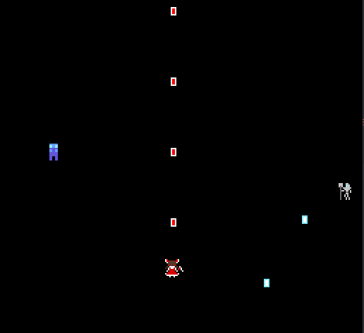

# Bullet Diver

Author: Yifan Jiang (yifanj3)

## Design:

The game is an endless arcade-style bullet hell where players must dodge and attack moving enemies to achieve higher scores. I originally planned to make more intricate bullet trails, but due to PPU sprite limitations, I used sine-wave enemy movement to both constrain player positioning and increase gameplay difficulty.

## Screen Shot:

## How Your Asset Pipeline Works:

<!-- (TODO: describe the steps in your asset pipeline, from source files to tiles/backgrounds/whatever you upload to the PPU466.)

(TODO: make sure the source files you drew are included. You can [link](your/file.png) to them to be a bit fancier.) -->

1) PNGs in the `assets/` folder are loaded as vectors of RGBA values using the helper function `load_png`.
2) For each PNG, I use `build_palette` to extract 4 unique colors from it and store them to PPU's `palette_table`.
3) Then, each PNG will be sliced to 8x8 PPU tiles using the helper function `build_tiles`. My player and enemy sprites are 16x16 so they will be stored as 4 8x8 tiles. Their tile data will be computed by the cloest color in the palette we create above.
4) The tile data and palette index are assigned to the PPU’s tile and sprite tables. Player, enemy, and projectile sprites are mapped to specific indices, the helper function `load_tiles` will return a vector of these indices for later rendering use.
5) In the `draw` function, we dynamically change the position of these tiles to achieve movement and collision detection.

## How To Play:

### Controls:
Use `WASD` to move the character. The character automatically fires bullets forward.

### Enemies:
- Overseer:
    - Moves in a sine-wave pattern
    - Shoots projectiles downward

- Voteless:
    - Moves straight downward
    - Deals damage on contact

### Objective:
Survive as long as possible while dodging enemy attacks and eliminating foes.

This game was built with [NEST](NEST.md).

